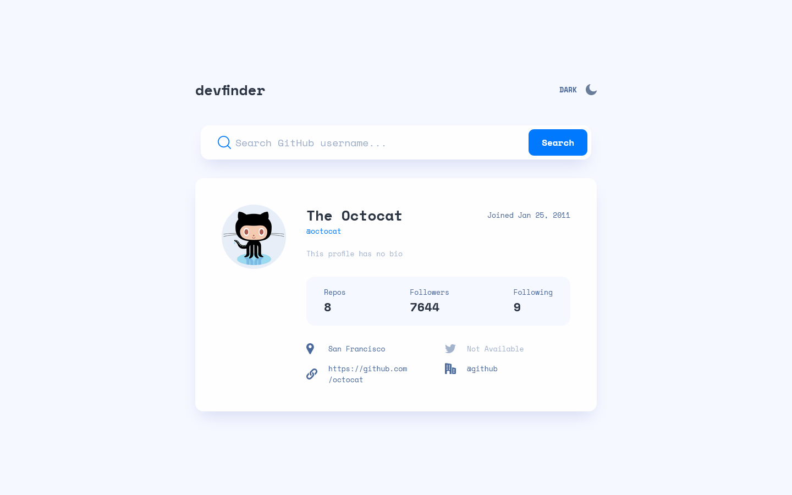

# Frontend Mentor - GitHub user search app solution

This is a solution to the [GitHub user search app challenge on Frontend Mentor](https://www.frontendmentor.io/challenges/github-user-search-app-Q09YOgaH6). Frontend Mentor challenges help you improve your coding skills by building realistic projects. 

## Table of contents

- [Overview](#overview)
  - [The challenge](#the-challenge)
  - [Screenshot](#screenshot)
  - [Links](#links)
- [My process](#my-process)
  - [Built with](#built-with)
  - [What I learned](#what-i-learned)
- [Author](#author)

## Overview

### The challenge

Users should be able to:

- View the optimal layout for the app depending on their device's screen size
- See hover states for all interactive elements on the page
- Search for GitHub users by their username
- See relevant user information based on their search
- Switch between light and dark themes
- **Bonus**: Have the correct color scheme chosen for them based on their computer preferences. _Hint_: Research `prefers-color-scheme` in CSS.

### Screenshot

### Links

- Solution URL: [https://www.frontendmentor.io/solutions/github-user-search-app-react-styled-components-tailwindcss-CnwTs2GWa7](https://www.frontendmentor.io/solutions/github-user-search-app-react-styled-components-tailwindcss-CnwTs2GWa7)
- Live Site URL: [https://abedfetrat.github.io/github-user-search-app/](https://abedfetrat.github.io/github-user-search-app/)

## My process

### Built with

- Mobile-first workflow
- [React](https://reactjs.org/) - JS library
- [Styled Components](https://styled-components.com/) - For styles
- [Tailwindcss](https://tailwindcss.com/) - For styles

### What I learned

I learned to use React to build a simple app and use an external API while also trying out and learning Styled Components and Tailwindcss for writing styles. 

I started with regular single CSS file (master branch)
Then Styled Components (using-styled-components branch)
Then Tailwindcss (using-tailwindcss branch)

## Author

- Frontend Mentor - [@abedfetrat](https://www.frontendmentor.io/profile/abedfetrat)
- Twitter - [@abedfetrat](https://www.twitter.com/abedfetrat)
- LinkedIn - [@abedfetrat](https://www.linkedin.com/in/abedfetrat)